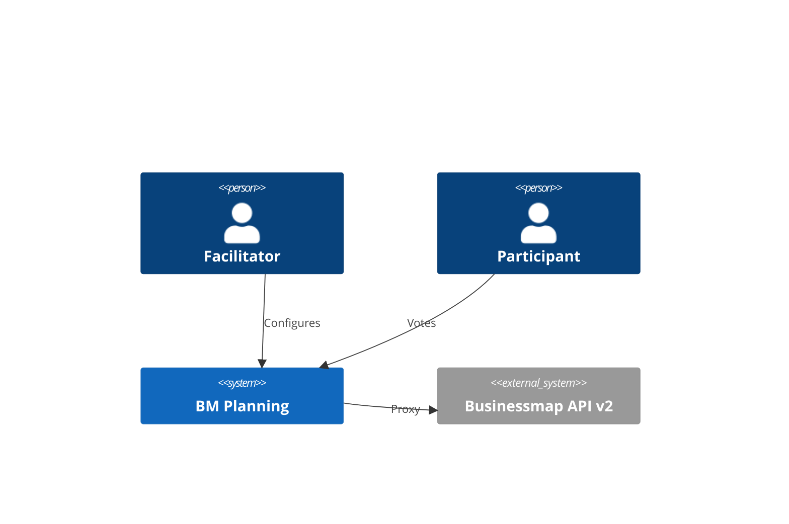

# Architecture — overview

Public document. Full specification in the private `bm-planning-spec` repository (`raw/architecture-spec.md`).

## Vision

BM Planning is Planning Poker integrated with [Businessmap](https://businessmap.io):

1. Facilitator connects with API Key (browser)
2. Builds card queue via filters
3. Team votes in real time
4. Consensus persists to the card custom field

## Diagram



## Recorded decisions

See [decisions/README.md](../decisions/README.md).

## Code structure (target)

```text
server/
  cmd/server/
  internal/api|services|repositories|models|providers/
web/
```

Detail: [ADR-003](../decisions/ADR-003-go-project-layout.md).

## Roadmap

| Phase | Scope |
|-------|-------|
| M0 | Mocked UI ✅ partial |
| M1 | Businessmap no browser (facilitador) |
| M2 | Rooms + WebSocket |
| M3 | Voting |
| M4 | Custom field sync |
| M5 | Hardening + deploy |

Audited status: `bm-planning-spec/specs/_index.md`.
